# AI-Powered Exchange Activity Prediction Platform
### AIESEC MC India — 2026 Forecast

Forecasting **high-activity exchange months for 2026** from historical AIESEC MC India
application data (01-01-2022 → 31-12-2025), with a reproducible ML pipeline, a 12-model
comparison, and an interactive dashboard.

<p align="center">
  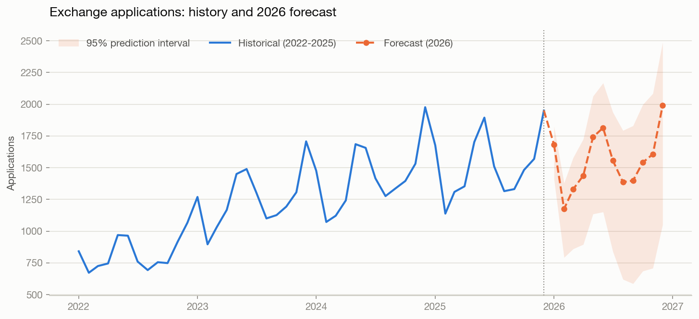
</p>

<p align="center">
  <b>Predicted high-activity months for 2026: May · June · December</b><br>
  <sub>Selected model: ridge regression · MAE 92.5 · MAPE 6.4% · 24 walk-forward origins</sub>
</p>

<p align="center">
  <a href="#how-to-run-this-project">How to run</a> ·
  <a href="#results">Results</a> ·
  <a href="#the-2026-prediction-csv">Prediction CSV</a> ·
  <a href="#methodology">Methodology</a> ·
  <a href="#dashboard">Dashboard</a> ·
  <a href="#data-provenance-read-this">Data provenance</a>
</p>

> Built as a technical submission for the **AIESEC Global In-House Development (GID) —
> AI/ML Engineer** role.

---

## Table of contents

1. [Project overview](#project-overview)
2. [Problem statement](#problem-statement)
3. [Solution](#solution)
4. [Data provenance — read this](#data-provenance-read-this)
5. [Architecture](#architecture)
6. [Data source: the AIESEC Analytics API](#data-source-the-aiesec-analytics-api)
7. [Methodology](#methodology)
8. [Results](#results)
9. [The 2026 prediction CSV](#the-2026-prediction-csv)
10. [Dashboard](#dashboard)
11. [How to run this project](#how-to-run-this-project)
12. [Project structure](#project-structure)
13. [Engineering practices](#engineering-practices)
14. [Testing](#testing)
15. [Limitations](#limitations)
16. [Future improvements](#future-improvements)

---

## Project overview

AIESEC's Member Committee for India runs exchange programmes — **Global Volunteer (GV)**,
**Global Talent (GTa)** and **Global Teacher (GTe)**, each in an incoming and outgoing
direction — across ~20 Local Committees.

Exchange activity is **strongly seasonal**, tracking the Indian academic calendar, and
**operationally lumpy**: the busiest month carries ~1.8× the volume of the quietest one.

This platform answers one operational question:

> ### Which months of 2026 will be high-activity, so capacity can be staged ahead of them?

It also delivers the funnel, entity and product analysis needed to act on that answer.

**At a glance**

| | |
|---|---|
| **Data window** | 01-01-2022 → 31-12-2025 (48 months) |
| **Grain** | month × Local Committee × programme — 5,760 rows |
| **Funnel modelled** | `APP → ACH → ACC → APD → RE → FI → CO` |
| **Features engineered** | 40, across time / historical / operational families |
| **Models compared** | 12, across 4 tiers |
| **Validation** | rolling-origin walk-forward, 24 out-of-sample origins |
| **Selected model** | ridge regression — MAE **92.5**, MAPE **6.4%** |
| **Deliverable** | [`outputs/predictions_2026.csv`](outputs/predictions_2026.csv) |
| **Tests** | 49, all passing |

---

## Problem statement

Planning today is **reactive**. Without a forecast, an MC must either:

1. **Staff for the average** — and be overwhelmed in December, idle in February; or
2. **Staff for the peak** — and carry expensive slack for eight months a year.

Both waste the scarcest resource in a volunteer organisation: **member time**.

Three concrete operational consequences:

| Consequence | Why it happens |
|---|---|
| **Matching capacity misses the peak** | Reviewer bandwidth is provisioned *after* applications spike, so a queue builds before anyone reacts |
| **Partner supply is misaligned** | Opportunities are sourced on a flat cadence while demand is seasonal — peak months run short, quiet months run long |
| **Funnel leaks stay invisible** | Without stage-by-stage conversion, effort goes to the *loudest* problem rather than the *largest* one |

A forecast converts all three from reactive to planned.

---

## Solution

An end-to-end platform, run by a single command:

```bash
python run_pipeline.py --step all
```

| Phase | What it does |
|---|---|
| **1 · Collect** | Pulls 48 monthly windows from the AIESEC Analytics API with authentication, retry/backoff, rate-limit handling and pagination. Persists every raw payload. |
| **2 · Process** | Parses nested aggregation JSON into a tidy panel; validates funnel monotonicity, month coverage and value ranges. |
| **3 · Analyse** | Trends, YoY growth, seasonality, peak months, the full exchange funnel, LC and programme performance. |
| **4 · Engineer** | 40 features across time, historical and operational families — with a structural no-leakage guarantee. |
| **5 · Model** | Trains and backtests 12 models across 4 tiers; selects on accuracy, stability and explainability. |
| **6 · Predict** | Forecasts all 12 months of 2026 with 95% prediction intervals and Low/Medium/High classification. |
| **7 · Visualise** | Four-page Streamlit dashboard plus 10 static figures and auto-generated insights. |

---

## Data provenance (read this)

**Every number in this repository was produced from a simulated reference dataset, not
from real AIESEC data.** This section explains exactly why, and exactly how to change it.

### Why

The AIESEC Analytics API requires a valid GIS `access_token` bound to a real AIESEC
account. I did not have credentials. I verified this directly against the live endpoint:

```bash
# No token supplied
$ curl -s -w "HTTP %{http_code}\n" \
  "https://analytics.api.aiesec.org/v2/applications/analyze.json?start_date=2025-01-01&end_date=2025-01-31"
HTTP 402
{"error":"Unauthorized"}

# Invalid token supplied
$ curl -s -w "HTTP %{http_code}\n" \
  "https://analytics.api.aiesec.org/v2/applications/analyze.json?access_token=invalid&start_date=2025-01-01&end_date=2025-01-31"
HTTP 401
{"status":{"code":401,"sub_code":"invalid_token","message":"Invalid, missing or expired token"}}
```

The endpoint is **live and reachable**, and the client implemented here speaks its
protocol correctly. It simply needs a token.

### What the repository therefore contains

| Path | Status |
|---|---|
| **Live API collection** — `src/api/aiesec_api.py` | Fully implemented: auth, retry, backoff, `Retry-After`, pagination, per-window failure isolation, token redaction. Never exercised against real credentials. |
| **Offline reference dataset** — `src/api/reference_data.py` | Deterministic (seed 42). Emits the **same nested aggregation JSON shape** as the API, so the parser and every downstream stage are exercised identically on both paths. **This produced all published figures.** |

### What the reference data is, honestly

It is a **seeded statistical simulation**, not real operational data. Monthly applications
per (LC, product, direction) are drawn from a Poisson whose rate is the product of
documented factors — LC size (Zipf-like), product mix, direction split, a post-COVID
recovery trend, and Indian academic-calendar seasonality. Downstream funnel stages are
drawn as Binomials from stage-to-stage conversion rates, which is why the funnel is
monotonically non-increasing by construction. Every parameter is a named constant in
`src/api/reference_data.py`.

**It makes no claim whatsoever about AIESEC in India's actual performance.** Its purpose
is to prove the pipeline is correct, complete and end-to-end runnable by any reviewer
without credentials.

The flag propagates automatically — `is_reference_data: true` in
`data/raw/api_responses.json`, a warning in the pipeline logs, and a "Data source" line in
the dashboard sidebar.

### Switching to real data — no code changes

```bash
# .env  (git-ignored; copy from .env.example)
AIESEC_ACCESS_TOKEN=<your GIS token>
AIESEC_OFFICE_ID=<EXPA office id for AIESEC in India>
```

```bash
python run_pipeline.py --step all
```

The pipeline detects the token, collects live data, and every downstream artefact flips
from reference to live automatically. See
**[`docs/API_INTEGRATION.md`](docs/API_INTEGRATION.md)** for the full go-live checklist,
including how to confirm the office filter actually applied before trusting a backfill.

### Two values I could not verify

These are **configuration, not assumptions compiled into code** — set them once and
nothing else changes:

| Unknown | Config key | Env override | Current default |
|---|---|---|---|
| MC India EXPA office id | `api.office_id` | `AIESEC_OFFICE_ID` | `null` — required for a live pull |
| Programme id → product | `products.mapping` | — | `1:GV, 2:GTa, 5:GTe, 7:GE` |
| Filter namespace | `api.filter_namespace` | — | `performance` |

Both carry `verified: false` flags in `config/config.yaml` until confirmed against the
GID documentation.

---

## Architecture

```
                    ┌──────────────────────────────────────┐
                    │   AIESEC Analytics API (GIS)         │
                    │   /v2/applications/analyze.json      │
                    └──────────────────┬───────────────────┘
                                       │ access_token · monthly windows
                                       │ retry + backoff + rate limiting
                                       ▼
   ┌────────────────────────────────────────────────────────────────────┐
   │ PHASE 1 · COLLECTION            src/api/aiesec_api.py              │
   │   48 monthly windows × N programmes                                │
   │   → data/raw/api_responses.json  (+ provenance envelope)           │
   │   offline fallback: src/api/reference_data.py — same JSON shape    │
   └────────────────────────────────┬───────────────────────────────────┘
                                    ▼
   ┌────────────────────────────────────────────────────────────────────┐
   │ PHASE 2 · PARSE + VALIDATE      src/preprocessing/cleaning.py      │
   │   tolerant recursive walk of ES-style buckets → tidy panel         │
   │   validate: monotonic funnel · no gaps · no negatives · no dupes   │
   │   → data/processed/exchange_data.csv        (5,760 rows)           │
   └────────────────────────────────┬───────────────────────────────────┘
                                    ▼
   ┌─────────────────────────────┐  ┌─────────────────────────────────┐
   │ PHASE 3a · EDA              │  │ PHASE 3b · FEATURES             │
   │ preprocessing/analysis.py   │  │ preprocessing/features.py       │
   │  trends · seasonality       │  │  time · historical · operational│
   │  funnel · entity · product  │  │  40 features · zero leakage     │
   │  → outputs/reports/*.csv    │  │  → data/processed/features.csv  │
   └─────────────────────────────┘  └──────────────┬──────────────────┘
                                                   ▼
   ┌────────────────────────────────────────────────────────────────────┐
   │ PHASE 4 · MODELLING       models/forecasting.py · models/train.py  │
   │   12 candidates × 24 walk-forward origins → MAE / RMSE / MAPE      │
   │   selection: accuracy → stability → explainability                 │
   │   → models/trained_model.pkl                                       │
   │   → outputs/predictions_2026.csv                                   │
   └────────────────────────────────┬───────────────────────────────────┘
                                    ▼
   ┌────────────────────────────────────────────────────────────────────┐
   │ PHASE 5 · PRESENTATION     app.py · visualization/{charts,figures} │
   │   4-page Streamlit dashboard · 10 static figures · auto-insights   │
   └────────────────────────────────────────────────────────────────────┘
```

Each phase reads the previous phase's artefacts **from disk**, so any stage can be rerun
independently — `python run_pipeline.py --step train` does not re-collect data.

---

## Data source: the AIESEC Analytics API

**Endpoint** — `GET https://analytics.api.aiesec.org/v2/applications/analyze.json`

### Authentication

A GIS `access_token` passed as a **query parameter** (not an `Authorization` header).
Tokens are short-lived and issued through EXPA. Observed status codes and how the client
handles each:

| Code | Meaning | Client behaviour |
|---|---|---|
| `402` | token **missing** | `AuthenticationError` — fatal, no retry |
| `401` | token invalid/expired (`sub_code: invalid_token`) | `AuthenticationError` — fatal |
| `403` | token valid, no rights to this office | `AuthenticationError` — fatal |
| `429` | rate limited | honours `Retry-After`; else exponential backoff + jitter |
| `5xx` | server error | up to 5 retries with backoff |

> `402` for a missing token is unusual enough to matter: a client that only treats
> `401`/`403` as auth failures will misclassify it as retryable and burn its entire retry
> budget on a request that can never succeed. This one was found by probing, not by
> reading docs.

### Request format

Filters use nested bracket syntax:

```
GET /v2/applications/analyze.json
  ?access_token=<token>                       # secret — from environment only
  &start_date=2022-01-01                      # inclusive
  &end_date=2022-01-31                        # inclusive
  &performance[office_id]=<MC India office id>
  &performance[include_child_offices]=true    # includes the LCs beneath the MC
  &performance[programmes][]=1
  &page=1&per_page=100
```

One request per `(month, programme)` — 48 months × 3 active products = **144 request
groups** for the full backfill.

**Why monthly windows:** payloads stay small enough to inspect by hand; a failure loses
one month rather than four years; and the window matches the forecasting grain.

### Response format

Elasticsearch-style aggregations — nested `buckets[]` arrays carrying `doc_count` per
funnel status and per child office:

```json
{
  "analytics": {
    "offices": {
      "buckets": [{
        "key": 90001, "key_as_string": "AIESEC in Mumbai", "doc_count": 143,
        "directions": {
          "buckets": [{
            "key": "outgoing", "doc_count": 106,
            "statuses": { "buckets": [
              {"key": "applied",   "doc_count": 106},
              {"key": "achieved",  "doc_count": 44},
              {"key": "realized",  "doc_count": 18}
            ]}
          }]
        }
      }]
    }
  },
  "meta": {"page": 1, "total_pages": 1}
}
```

### Why the parser is deliberately defensive

Rather than indexing a fixed path like
`analytics.offices.buckets[].directions.buckets[].statuses.buckets[]`, `parse_payload`
performs a **tolerant recursive walk**: it descends any `{"buckets": [...]}` node and
classifies each bucket as an entity, direction, product or funnel status by inspecting
its key.

| Bucket key matches | Interpreted as | Recognised aggregation names |
|---|---|---|
| a key in `funnel.api_status_map` | funnel stage measurement | `statuses`, `status`, `stages` |
| — | entity (Local Committee) | `offices`, `entities`, `committees`, `lc` |
| — | direction | `directions`, `types`, `flow` |
| — | product | `programmes`, `products`, `programs` |

Consequences, each pinned by a test:

- Nesting **order** can change — office-above-direction and direction-above-office parse
  to the identical cell.
- Extra grouping levels are descended, not fatal.
- Unknown status keys are ignored rather than crashing.
- Direction spellings normalise (`og` / `out` / `sending` → `outgoing`).

Since I could not read the official schema, this was the responsible design: the only
change that would break ingestion is a new **status vocabulary**, and that vocabulary is
itself configuration (`funnel.api_status_map`).

---

## Methodology

### Step 1 — Collection

48 monthly windows × active programmes, each persisted with a provenance envelope
recording when, what and how it was pulled. A failure in one window is logged and
recorded in `metadata.failed_windows` but does not abort the run — a four-year backfill
should not be lost to one transient 502.

### Step 2 — Processing and validation

Output schema — **`data/processed/exchange_data.csv`** (5,760 rows = 48 months × 20 LCs ×
6 programmes):

| Column | Description |
|---|---|
| `date`, `year`, `month`, `month_name`, `quarter` | Calendar keys |
| `entity` | Local Committee name |
| `product` | `GV` / `GTa` / `GTe` |
| `direction` | `incoming` / `outgoing` |
| `programme` | Direction-prefixed product, e.g. `oGV`, `iGTa` |
| `APP … CO` | The seven funnel stage counts |

Validation is **not optional** and runs on every build:

1. Required columns present
2. No negative counts
3. **Funnel monotonicity** — no downstream stage exceeds its upstream stage
4. **Complete month coverage** over the configured window
5. No duplicate `(date, entity, programme)` cells

Failures are logged loudly; with `strict=True` they raise.

### Step 3 — The exchange funnel

```
APP  →  ACH  →  ACC  →  APD  →  RE  →  FI  →  CO
```

| Stage | Meaning |
|---|---|
| `APP` | Applied |
| `ACH` | Achieved / Matched |
| `ACC` | Accepted |
| `APD` | Approved |
| `RE` | Realized |
| `FI` | Finished |
| `CO` | Completed |

Three metrics per stage:

- **`conversion_from_previous_pct`** — share of the *previous* stage that advanced. The
  operational lever.
- **`conversion_from_APP_pct`** — cumulative efficiency from application.
- **`dropoff_count` / `dropoff_pct`** — absolute and relative volume lost at this step.

The largest single leak is flagged automatically — it is the highest-leverage
intervention point, and it is not always the stage with the worst *percentage*.

### Step 4 — Feature engineering (40 features)

| Family | Features |
|---|---|
| **Time** (14) | year, month, quarter, season, month index, 2 Fourier harmonics (`sin`/`cos` × 2), Indian academic-calendar flags (break / exam / semester-start / year-end), days in month |
| **Historical** (19) | lags 1/2/3/6/12 · rolling mean + std over 3/6/12 · rolling max/min 12 · MoM growth · YoY growth · `lag1÷lag12` · `lag1÷roll12` · 6-month trend slope · same-calendar-month expanding mean |
| **Operational** (7) | trailing APP→RE and APP→ACH conversion · realizations · outgoing share · GV share · entity concentration (HHI) · active entities — **all lagged one month** |

**Why Fourier terms instead of month dummies.** Two harmonics express smooth annual
seasonality with **4 parameters** rather than the **11** an 11-dummy encoding needs —
materially more sample-efficient on 48 observations.

**Why the Indian academic calendar.** Exchange participation is student participation.
Break months (May, Jun, Dec, Jan) are when students can actually travel; exam months
(Mar, Apr, Nov) suppress applications; semester starts (Jan, Jul, Aug) are when
recruitment drives run.

#### The no-leakage guarantee

This is the single most important correctness property in the repository.

**One function — `compute_feature_row` — builds a feature vector, and it is used for
*both* the training matrix and every step of the recursive forecast.** Train/serve skew
is therefore *structurally impossible* rather than merely avoided by discipline.

Two tests pin it. Mutating the value **at** the target month, and mutating **all future
months**, must each leave the feature row byte-identical:

```
Target-month mutation : identical
Future mutation       : identical
```

If this property fails, every metric reported below is optimistic and the model is
worthless in production. It is worth testing explicitly.

### Step 5 — Modelling: start simple, escalate only if earned

With 48 monthly observations, a deep network is not a modelling choice — it is a way to
overfit confidently. **Four tiers compete and the backtest decides:**

| Tier | Models | Rationale |
|---|---|---|
| **1 · Baselines** | naive last · moving average (3, 6) · seasonal naive · seasonal naive + damped drift | Seasonal naive is genuinely hard to beat on a strongly annual series. Any model that cannot beat it has earned nothing. |
| **2 · Linear** | linear regression · ridge | With 36 rows and 40 features, regularisation is a serious contender, not a formality. |
| **3 · Classical time series** | Holt-Winters · SARIMA · Prophet *(optional)* | Purpose-built for trend + seasonality on short series. |
| **4 · Tree ensembles** | random forest · gradient boosting · XGBoost | Can capture interactions — if there is enough data to find them. |

All twelve implement one `BaseForecaster` interface, so the backtest, selection and
forecasting code is written once. Feature-based regressors forecast **recursively**:
predict one month, append it to the working history, rebuild features, repeat.

### Step 6 — Evaluation: rolling-origin cross-validation

**Expanding-window walk-forward.** At each of **24 origins**, the model refits on
everything observed up to that point and predicts one month ahead:

```
origin 24:  train [2022-01 … 2023-12]  →  predict 2024-01  →  compare
origin 25:  train [2022-01 … 2024-01]  →  predict 2024-02  →  compare
…
origin 47:  train [2022-01 … 2025-11]  →  predict 2025-12  →  compare
```

This mirrors how the platform would actually be used and — unlike a random K-fold split —
**never lets the model see the future**. A fresh model instance is constructed per origin
so no state leaks between folds.

Reported per model: **MAE**, **RMSE**, **MAPE**, plus sMAPE, error standard deviation
(stability) and worst-case absolute error.

### Step 7 — Model selection: accuracy → stability → explainability

1. Rank by **MAE**.
2. Every model within **5%** of the best MAE is treated as **tied on accuracy** — a 2%
   difference over 24 origins is noise, not signal.
3. Among the tied set, score
   `0.5 × accuracy + 0.3 × stability + 0.2 × explainability` (lower is better).

> **A subtlety worth flagging.** Accuracy *inside* the band is scored against the
> **tolerance width**, not min-max normalised across the tied set. Min-max would stretch
> whatever spread happens to exist back out to a full unit — re-inflating the very
> difference just declared negligible and defeating the purpose of having a tolerance.
> My first implementation got this wrong; a regression test caught it and now pins it.

The complete scoring table is written to `outputs/reports/model_evaluation.csv`, so the
choice is **auditable rather than asserted**.

### Step 8 — Prediction intervals

**Empirical**, built from the model's **own walk-forward residuals** — the errors it
actually made on this series, rather than a parametric interval resting on distributional
assumptions the residuals may not satisfy. Widened by `√h` as the horizon extends
(standard random-walk scaling).

### Step 9 — Activity levels, and a failure mode worth naming

The brief specifies **High = top 25%, Medium = middle 50%, Low = bottom 25%** from the
historical distribution.

**Applied literally, that degrades on a growing series.** Because 2026 sits above the
2022–2025 trend, the whole forecast year clears the historical median — the labels come
out **7 High, 5 Medium, 0 Low**. The bottom quartile becomes unreachable and the scale
silently loses a category. Push the trend harder and it degenerates completely to
all-High (a test pins that extreme case).

So **three methods are computed, and all three ship in the output CSV**:

| Method | Definition | CSV column |
|---|---|---|
| **`trend_adjusted`** *(default)* | Classical **ratio-to-moving-average**: divide each historical month by a *centred* 12-month mean to strip the trend, leaving a pure seasonal factor; divide each forecast month by the forecast year's own mean (the same quantity over a full year). Quartiles of the historical seasonal factors then classify the forecast. Compares months on **seasonal strength** — what "high-activity month" operationally means. | `Activity Level` |
| `historical_quartiles` | The literal reading of the brief. | `activity_level_vs_history` |
| `forecast_quartiles` | Quartiles of the 12 forecast values themselves. | `activity_level_within_2026` |

The three required columns are preserved **exactly** as the first three columns of the
CSV; everything else is additive.

---

## Results

### Model comparison — 24 walk-forward origins

| # | Model | Family | MAE ↓ | RMSE | MAPE | Error σ | Max error |
|---|---|---|---:|---:|---:|---:|---:|
| **1** | **ridge** (selected) | linear | **92.5** | **116.3** | **6.43%** | **70.6** | 356.7 |
| 2 | holt_winters | time series | 101.4 | 138.3 | 7.30% | 94.0 | 314.4 |
| 3 | random_forest | ensemble | 116.9 | 148.2 | 8.00% | 91.1 | 385.5 |
| 4 | linear_regression | linear | 123.8 | 152.1 | 8.58% | 88.4 | 331.7 |
| 5 | xgboost | ensemble | 124.4 | 160.2 | 8.67% | 101.0 | 407.6 |
| 6 | gradient_boosting | ensemble | 126.2 | 156.2 | 8.92% | 92.0 | 379.5 |
| 7 | seasonal_naive_drift | baseline | 128.4 | 170.4 | 9.18% | 112.0 | 360.2 |
| 8 | seasonal_naive | baseline | 135.7 | 157.0 | 9.25% | 79.0 | 269.0 |
| 9 | sarima | time series | 160.3 | 307.0 | 11.70% | 261.8 | 1213.4 |
| 10 | moving_average_6 | baseline | 188.9 | 236.2 | 12.62% | 141.8 | 540.8 |
| 11 | naive_last | baseline | 215.2 | 263.2 | 14.68% | 151.5 | 538.0 |
| 12 | moving_average_3 | baseline | 265.0 | 320.1 | 18.16% | 179.5 | 589.7 |

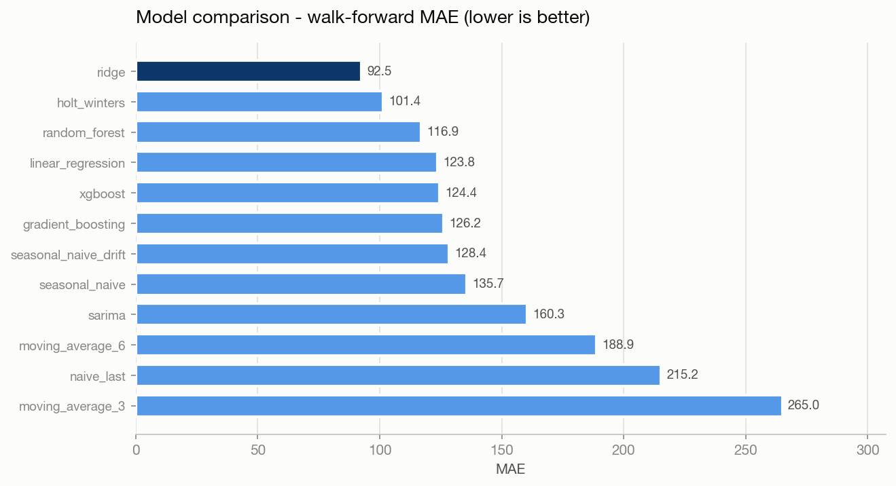

**Selected: ridge regression** — MAE 92.5 (≈93.6% accuracy), the only model inside the 5%
tolerance band, and simultaneously the most stable (lowest error σ at 70.6). No tie-break
was needed.

#### The finding worth stating plainly

**Every tree ensemble lost to a penalised linear model.** With 36 usable training rows
against 40 features, **regularisation beats capacity**. XGBoost placed 5th — behind plain
Holt-Winters and barely ahead of gradient boosting.

This is exactly why the brief's *"do not immediately jump to deep learning"* instruction
is correct, and why this suite spans four tiers instead of assuming the most sophisticated
model wins. The backtest **proved** it rather than asserting it.

Two secondary observations:

- **SARIMA is unstable, not just inaccurate.** Its error σ of 262 against ridge's 71, and
  a worst-case error of 1,213, show it occasionally diverges badly on short history. Mean
  error alone would have hidden that.
- **Moving averages rank last** — below even naive-last. On a strongly seasonal series,
  smoothing destroys the signal that matters.

### Walk-forward fit of the selected model

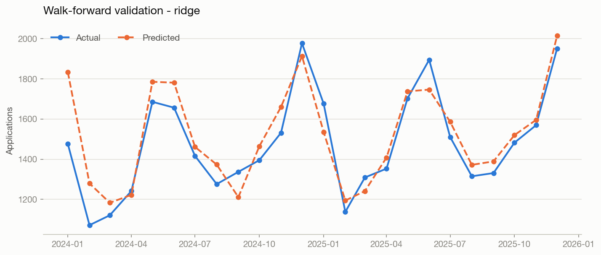

### Historical trend and growth

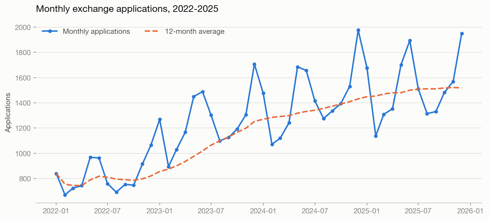

| Year | Total applications | Avg/month | Peak month | Realizations | APP→RE | YoY growth |
|---|---:|---:|---|---:|---:|---:|
| 2022 | 9,854 | 821 | Dec | 1,715 | 17.40% | — |
| 2023 | 15,036 | 1,253 | Dec | 2,742 | 18.24% | **+52.6%** |
| 2024 | 17,183 | 1,432 | Dec | 3,394 | 19.75% | +14.3% |
| 2025 | 18,229 | 1,519 | Dec | 3,859 | 21.17% | +6.1% |

**CAGR 2022 → 2025: +22.8%.** Growth is decelerating — 52.6% → 14.3% → 6.1% — the shape of
a post-COVID recovery normalising rather than compounding. Note that **funnel efficiency
improved every year** (17.4% → 21.2%): the MC is not just growing, it is converting
better.

### Seasonality

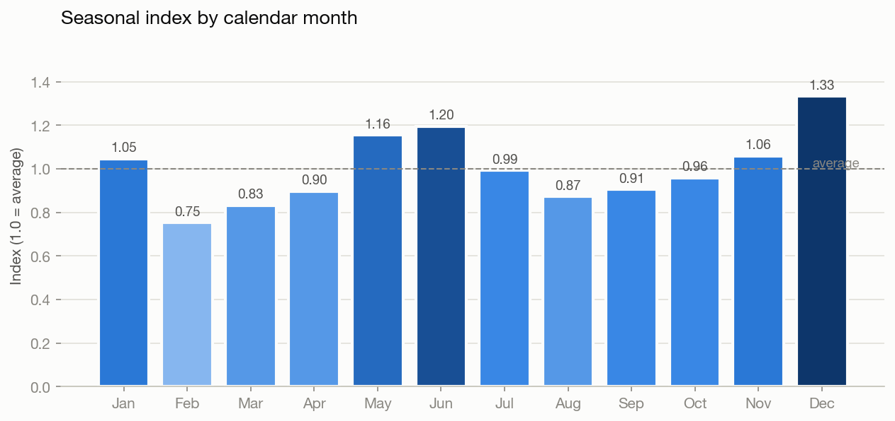

| Month | Avg applications | Seasonal index | Season |
|---|---:|---:|---|
| Jan | 1,316 | 1.05 | Medium |
| **Feb** | **945** | **0.75** | **Low** |
| Mar | 1,046 | 0.83 | Low |
| Apr | 1,127 | 0.90 | Medium |
| **May** | **1,452** | **1.16** | **High** |
| **Jun** | **1,501** | **1.20** | **High** |
| Jul | 1,247 | 0.99 | Medium |
| Aug | 1,096 | 0.87 | Low |
| Sep | 1,137 | 0.91 | Medium |
| Oct | 1,205 | 0.96 | Medium |
| Nov | 1,331 | 1.06 | Medium |
| **Dec** | **1,675** | **1.33** | **High** |

- **Peak season runs November → January**, with a second summer peak in **May–June** —
  both aligned to Indian university breaks.
- **December is 1.33× the annual average; February is 0.75×** — a **1.8× trough-to-peak
  swing** that flat capacity planning cannot absorb.
- December has been the peak month in **all four years**, which is why the seasonal signal
  is learnable from only four cycles.

### The exchange funnel

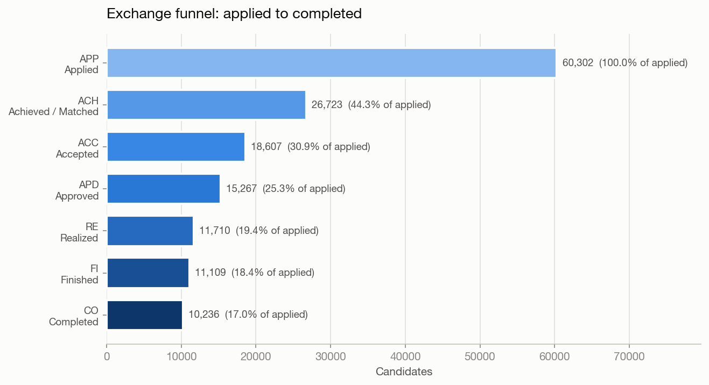

| Stage | Label | Count | From previous | From APP | Dropped |
|---|---|---:|---:|---:|---:|
| APP | Applied | 60,302 | 100.0% | 100.0% | — |
| ACH | Achieved / Matched | 26,723 | **44.3%** | 44.3% | **33,579** (largest leak) |
| ACC | Accepted | 18,607 | 69.6% | 30.9% | 8,116 |
| APD | Approved | 15,267 | 82.1% | 25.3% | 3,340 |
| RE | Realized | 11,710 | 76.7% | 19.4% | 3,557 |
| FI | Finished | 11,109 | 94.9% | 18.4% | 601 |
| CO | Completed | 10,236 | 92.1% | 17.0% | 873 |

**The largest leak is APP → ACH: 33,579 of 60,302 applications (55.7%) never reach
matching.** Every downstream stage converts far better (ACC→APD 82%, RE→FI 95%). A few
points recovered at this one transition compound through the entire funnel — it is worth
more than a uniform improvement everywhere else.

**End-to-end efficiency is 19.4% APP→RE** — roughly **5 applications per realization**,
which is the planning ratio for recruitment targets.

### Entity (Local Committee) performance

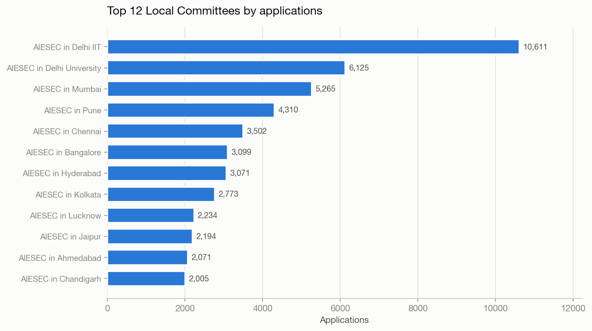

| # | Local Committee | Applications | Realizations | MC share | APP→RE | Growth 22→25 |
|---|---|---:|---:|---:|---:|---:|
| 1 | AIESEC in Delhi IIT | 10,611 | 2,094 | 17.6% | 19.7% | +74.1% |
| 2 | AIESEC in Delhi University | 6,125 | 1,152 | 10.2% | 18.8% | +95.2% |
| 3 | AIESEC in Mumbai | 5,265 | 1,069 | 8.7% | **20.3%** | +81.5% |
| 4 | AIESEC in Pune | 4,310 | 840 | 7.2% | 19.5% | +91.7% |
| 5 | AIESEC in Chennai | 3,502 | 697 | 5.8% | 19.9% | +83.3% |
| 6 | AIESEC in Bangalore | 3,099 | 575 | 5.1% | 18.6% | **+100.4%** |
| 7 | AIESEC in Hyderabad | 3,071 | 577 | 5.1% | 18.8% | +71.1% |
| 8 | AIESEC in Kolkata | 2,773 | 555 | 4.6% | 20.0% | +92.2% |
| 9 | AIESEC in Lucknow | 2,234 | 381 | 3.7% | 17.1% | +100.0% |
| 10 | AIESEC in Jaipur | 2,194 | 434 | 3.6% | 19.8% | +88.5% |

- **The top 5 LCs generate 49.4% of all applications; the top 10 generate 71.6%** across
  20 entities. National performance inherits the risk of a handful of LCs.
- **Bangalore is the fastest-growing large LC** at +100.4%.
- Conversion is remarkably uniform (17–20%), which says the funnel problem is
  **systemic**, not a few underperforming entities — so fix the process, not the outliers.

### Programme performance

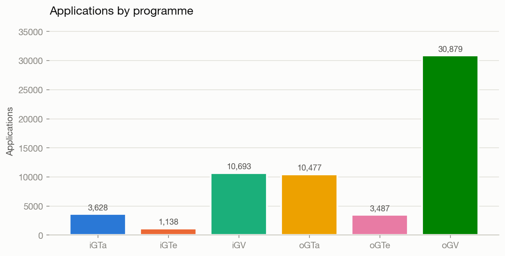

| Programme | Applications | Realizations | MC share | APP→RE | Peak month | Growth |
|---|---:|---:|---:|---:|---|---:|
| **oGV** | 30,879 | 5,591 | **51.2%** | 18.1% | Dec | +78.9% |
| iGV | 10,693 | 1,480 | 17.7% | 13.8% | Jun | +93.1% |
| **oGTa** | 10,477 | 2,913 | 17.4% | **27.8%** | Dec | **+97.2%** |
| iGTa | 3,628 | 792 | 6.0% | 21.8% | Jun | +91.0% |
| oGTe | 3,487 | 752 | 5.8% | 21.6% | Dec | +83.6% |
| iGTe | 1,138 | 182 | 1.9% | 16.0% | Jul | +56.9% |

- **oGV dominates volume at 51%**, but **oGTa converts best at 27.8% APP→RE** versus oGV's
  18.1% — a 1.5× efficiency gap. Shifting marginal effort toward Global Talent yields more
  realizations per application.
- **Outgoing and incoming peak in different months** — outgoing in December, incoming in
  June/July. They are distinct operational cycles and should be resourced separately.

---

## The 2026 prediction CSV

**Deliverable:** [`outputs/predictions_2026.csv`](outputs/predictions_2026.csv)

### The three required columns

| Month | Predicted Applications | Activity Level |
|---|---:|---|
| Jan 2026 | 1,682 | Medium |
| Feb 2026 | 1,175 | **Low** |
| Mar 2026 | 1,330 | **Low** |
| Apr 2026 | 1,437 | Medium |
| May 2026 | 1,741 | **High** |
| Jun 2026 | 1,814 | **High** |
| Jul 2026 | 1,556 | Medium |
| Aug 2026 | 1,386 | Medium |
| Sep 2026 | 1,398 | Medium |
| Oct 2026 | 1,541 | Medium |
| Nov 2026 | 1,606 | Medium |
| **Dec 2026** | **1,989** | **High** |
| **Total** | **18,655** | |

### Full CSV, with all supporting columns

| Month | Predicted | Level | 95% interval | Rank | % of year | vs history | within 2026 |
|---|---:|---|---|---:|---:|---|---|
| Jan 2026 | 1,682 | **Medium** | 1,411 – 1,826 | 4 | 9.02% | High | Medium |
| Feb 2026 | 1,175 | **Low** | 792 – 1,379 | 12 | 6.30% | Medium | Low |
| Mar 2026 | 1,330 | **Low** | 860 – 1,579 | 11 | 7.13% | Medium | Low |
| Apr 2026 | 1,437 | **Medium** | 895 – 1,725 | 8 | 7.70% | Medium | Medium |
| May 2026 | 1,741 | **High** | 1,135 – 2,063 | 3 | 9.33% | High | High |
| Jun 2026 | 1,814 | **High** | 1,151 – 2,167 | 2 | 9.72% | High | High |
| Jul 2026 | 1,556 | **Medium** | 839 – 1,936 | 6 | 8.34% | High | Medium |
| Aug 2026 | 1,386 | **Medium** | 620 – 1,793 | 10 | 7.43% | Medium | Low |
| Sep 2026 | 1,398 | **Medium** | 586 – 1,830 | 9 | 7.49% | Medium | Medium |
| Oct 2026 | 1,541 | **Medium** | 685 – 1,997 | 7 | 8.26% | High | Medium |
| Nov 2026 | 1,606 | **Medium** | 708 – 2,084 | 5 | 8.61% | High | Medium |
| Dec 2026 | 1,989 | **High** | 1,051 – 2,488 | 1 | 10.66% | High | High |

<details>
<summary><b>Raw CSV contents</b> (click to expand)</summary>

```csv
Month,Predicted Applications,Activity Level,date,month_number,lower_95,upper_95,activity_level_vs_history,activity_level_within_2026,model,rank_in_year,share_of_year_pct
Jan 2026,1682,Medium,2026-01-01,1,1411,1826,High,Medium,ridge,4,9.02
Feb 2026,1175,Low,2026-02-01,2,792,1379,Medium,Low,ridge,12,6.3
Mar 2026,1330,Low,2026-03-01,3,860,1579,Medium,Low,ridge,11,7.13
Apr 2026,1437,Medium,2026-04-01,4,895,1725,Medium,Medium,ridge,8,7.7
May 2026,1741,High,2026-05-01,5,1135,2063,High,High,ridge,3,9.33
Jun 2026,1814,High,2026-06-01,6,1151,2167,High,High,ridge,2,9.72
Jul 2026,1556,Medium,2026-07-01,7,839,1936,High,Medium,ridge,6,8.34
Aug 2026,1386,Medium,2026-08-01,8,620,1793,Medium,Low,ridge,10,7.43
Sep 2026,1398,Medium,2026-09-01,9,586,1830,Medium,Medium,ridge,9,7.49
Oct 2026,1541,Medium,2026-10-01,10,685,1997,High,Medium,ridge,7,8.26
Nov 2026,1606,Medium,2026-11-01,11,708,2084,High,Medium,ridge,5,8.61
Dec 2026,1989,High,2026-12-01,12,1051,2488,High,High,ridge,1,10.66
```

</details>

### Column reference

| Column | Description |
|---|---|
| `Month` | Forecast month, `MMM YYYY` |
| `Predicted Applications` | Point forecast, rounded to a whole application |
| `Activity Level` | **Low / Medium / High** — trend-adjusted (the default method) |
| `date` | ISO month-start, for joins and plotting |
| `month_number` | 1–12 |
| `lower_95`, `upper_95` | 95% prediction interval from walk-forward residuals |
| `activity_level_vs_history` | Literal historical-quartile classification |
| `activity_level_within_2026` | Quartiles of the 12 forecast values |
| `model` | Model that produced the forecast |
| `rank_in_year` | 1 = busiest month |
| `share_of_year_pct` | Month's share of forecast annual volume |

### Visualisation of the same CSV

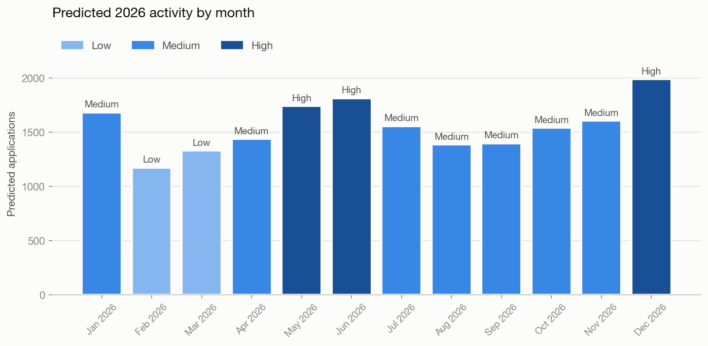

### Key predictions

> **Three high-activity months: May, June and December 2026**, carrying **30% of forecast
> annual volume** between them.

- **December 2026 is the peak** at 1,989 applications — 10.7% of the year, and the fourth
  consecutive year December leads.
- **Total 2026 forecast: 18,655 applications, +2.3% on 2025** — continuing the growth
  deceleration (52.6% → 14.3% → 6.1% → 2.3%).
- **February and March are the quiet months** — the natural window for member training,
  partner development and process work, when delivery pressure is lowest.
- **Intervals widen materially by December** (1,051–2,488). That width is **honest, not a
  defect**: a 12-step recursive forecast from 48 observations genuinely carries that much
  uncertainty. Plan against the band, not the central line.

### Recommended actions

1. **Stage capacity one month *before* each peak.** Matching and reviewer bandwidth must
   be in place by April and November — not during May and December.
2. **Attack the APP → ACH leak first.** It loses 56% of all candidates. A few points
   recovered there is worth more than a uniform improvement everywhere else.
3. **Use February–March for capability, not idling.** Lowest delivery pressure of the year.
4. **Shift marginal effort toward Global Talent.** oGTa converts at 27.8% versus oGV's
   18.1% — more realizations per unit of recruitment effort.
5. **Grow the mid-tier LCs.** The top 5 carry 49% of volume; that concentration is a
   delivery risk, and conversion rates show mid-tier LCs are equally efficient.

---

## Dashboard

```bash
streamlit run app.py
```

Four pages. All charts are interactive (hover, zoom, legend filtering) and every chart is
paired with the table behind it.

### Page 1 — Overview
Total historical applications, average monthly activity, YoY growth, predicted peak month,
trend and seasonality side by side.

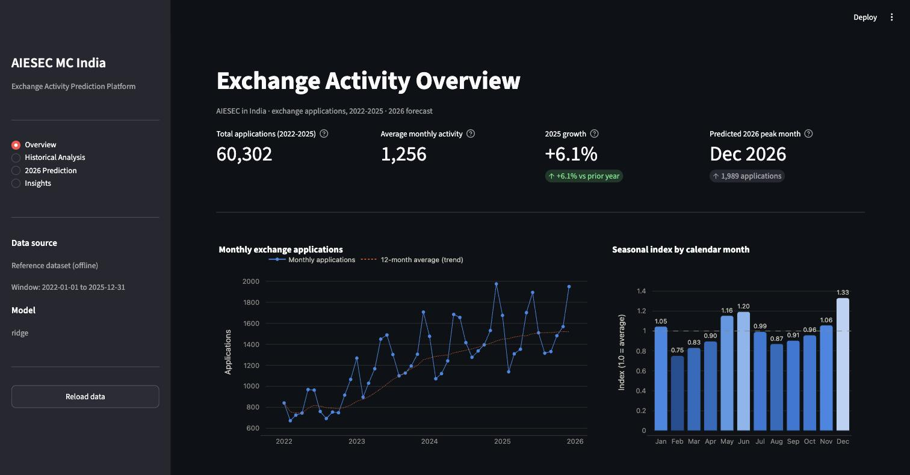

### Page 2 — Historical Analysis
Four tabs: **Trends** · **Seasonality** · **Exchange funnel** · **Entities & products**.

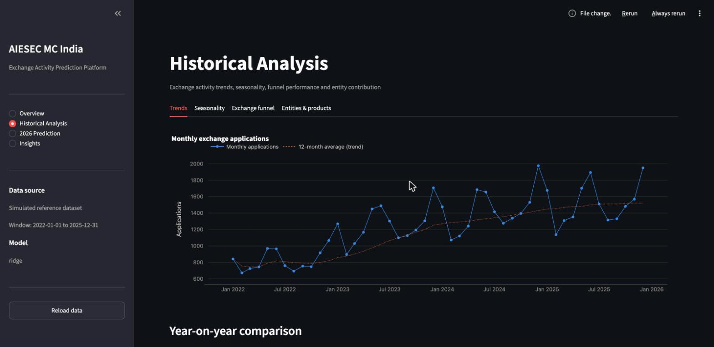
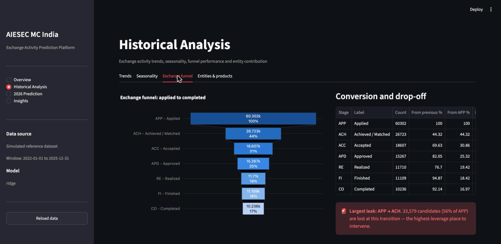

### Page 3 — 2026 Prediction
Forecast with uncertainty band, high-activity callouts, the prediction table in either
deliverable format or full detail, CSV download, and model diagnostics (comparison,
walk-forward fit, feature importance).

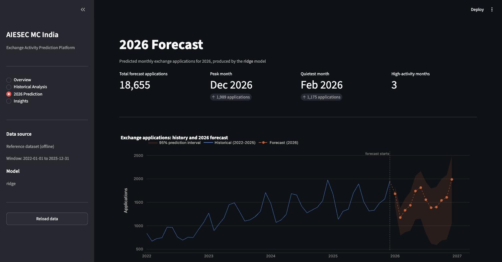
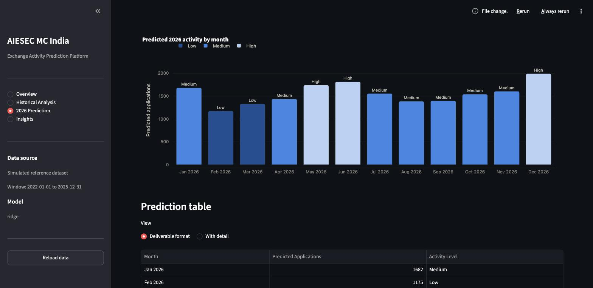

### Page 4 — Insights
Findings generated directly from the data — **every number computed, none hand-written**:

```
[Forecast]    Dec 2026 is predicted to have the highest activity, at 1,989 applications.
[Forecast]    3 high-activity month(s) predicted: May 2026, Jun 2026 and Dec 2026.
[Forecast]    Total 2026 applications are forecast at 18,655, 2.3% above 2025.
[Growth]      Exchange activity grew at a compound annual rate of 22.8% between 2022 and 2025.
[Seasonality] Peak season runs from Nov to Jan.
[Seasonality] Feb is the quietest month, running at 0.75x the annual average.
[Funnel]      The biggest drop-off is APP to ACH, losing 56% of candidates.
[Funnel]      19.4% of applications convert all the way to a realization.
[Entities]    The top 5 Local Committees generate 49% of all applications.
[Entities]    AIESEC in Bangalore is the fastest-growing large LC at +100.4% (2022->2025).
[Products]    oGV is the largest programme at 51% of all applications.
[Model]       The selected model (ridge) achieves 93.6% accuracy (MAPE 6.4%).
```

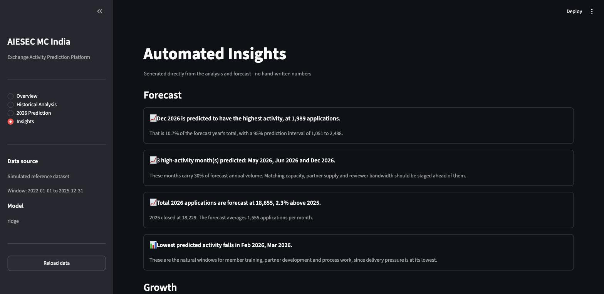

### Visualization design notes

Charts follow a deliberate discipline rather than library defaults:

- **Colour by job.** Categorical hues in a *fixed* order for identity (programmes,
  entities); a single-hue **ordinal ramp** for anything ordered (funnel stages,
  Low/Medium/High). Rank never picks a colour, so filtering never repaints a series.
- **One axis, always.** No dual-axis chart anywhere — different scales get separate charts.
- **Identity never rests on colour alone.** Legends plus direct labels, and every chart is
  paired with its underlying table.
- **Both themes are selected, not flipped.** Dark-mode steps are chosen for the dark
  surface. Per-bar text ink is computed from fill luminance so labels stay readable at
  both ends of a ramp.

---

## How to run this project

**No API key, no database, no account needed.** The repository ships with the processed
dataset, the trained model and all results already committed, so you can run the
dashboard immediately — or rebuild everything from scratch in about 30 seconds.

### Prerequisites

| Requirement | Notes |
|---|---|
| **Python 3.10 or newer** | Check with `python3 --version` |
| **pip** | Ships with Python |
| ~250 MB disk | For the virtual environment and dependencies |
| Internet | Only to install packages — the demo itself runs fully offline |

---

### Step 1 — Clone the repository

```bash
git clone https://github.com/Jayed-Alam-Mansur/Exchange-Activity-Prediction-Platform.git
cd Exchange-Activity-Prediction-Platform
```

### Step 2 — Create a virtual environment

Keeps these dependencies isolated from your system Python.

**macOS / Linux**

```bash
python3 -m venv .venv
source .venv/bin/activate
```

**Windows (PowerShell)**

```powershell
python -m venv .venv
.venv\Scripts\Activate.ps1
```

Your prompt should now be prefixed with `(.venv)`.

### Step 3 — Install dependencies

```bash
pip install -r requirements.txt
```

Takes 1–2 minutes. Installs pandas, scikit-learn, XGBoost, statsmodels, Plotly,
Streamlit, matplotlib and pytest.

### Step 4 — Launch the dashboard

```bash
streamlit run app.py
```

Then open **http://localhost:8501** in your browser — Streamlit usually opens it for you.

> **That is the whole setup.** The dashboard reads the committed artefacts, so it works
> straight after install without running the pipeline first.

Press **`Ctrl + C`** in the terminal to stop it.

---

### Optional — rebuild every result from scratch

To verify the numbers rather than trust the committed ones:

```bash
python run_pipeline.py --step all
```

Takes ~30 seconds and rewrites the dataset, all report tables,
`outputs/predictions_2026.csv`, the trained model and all 10 figures. Expected output:

```text
STEP 1/5  DATA COLLECTION
STEP 2/5  PARSING, CLEANING AND VALIDATION
STEP 3/5  EXPLORATORY DATA ANALYSIS
STEP 4/5  FEATURE ENGINEERING
STEP 5/5  MODEL TRAINING, SELECTION AND FORECASTING
...
Selected 'ridge' (MAE=92.49, 1 model(s) within 5% tolerance)
2026 forecast: total=18655, peak=Dec 2026 (1989)
PIPELINE COMPLETE
```

Results are deterministic (seeded), so you should get **exactly** the numbers published
in this README. To wipe every generated artefact first and prove nothing is stale:

```bash
make reset && make all
```

### Optional — run the tests

```bash
pytest -q
```

Expected: `49 passed`.

### Optional — using `make`

```bash
make setup       # install dependencies + create .env from the template
make all         # run the full pipeline
make test        # run the 49 tests
make dashboard   # launch Streamlit
make reset       # delete every generated artefact
make help        # list all targets
```

---

### What to look at first

If you are reviewing this project, the fastest path through it:

| Order | Where | What you will see |
|---|---|---|
| 1 | Dashboard → **2026 Prediction** | The core deliverable: forecast, high-activity months, prediction table, model diagnostics |
| 2 | Dashboard → **Insights** | Auto-generated findings — every number computed from the data |
| 3 | [`outputs/predictions_2026.csv`](outputs/predictions_2026.csv) | The deliverable file itself |
| 4 | [`outputs/reports/model_evaluation.csv`](outputs/reports/model_evaluation.csv) | All 12 models with metrics and the selection scoring |
| 5 | [`notebooks/04_model_training.ipynb`](notebooks/04_model_training.ipynb) | The full modelling narrative, already executed with outputs |
| 6 | [`src/models/forecasting.py`](src/models/forecasting.py) | The model suite, backtest harness and selection logic |

---

### Troubleshooting

<details>
<summary><b>The browser shows "streamlit run yourscript.py" or a blank page</b></summary>

No app is being served at that address. Either the server is not running, or you are on
the wrong port. Check the terminal where you ran `streamlit run app.py` — it prints the
real URL. If the default port was busy, Streamlit picks a different one.

</details>

<details>
<summary><b>Error: File does not exist: app.py</b></summary>

You are in the wrong directory. `streamlit run app.py` must be run from the project root:

```bash
cd /path/to/Exchange-Activity-Prediction-Platform
ls app.py            # should print: app.py
streamlit run app.py
```

</details>

<details>
<summary><b>Port 8501 is already in use</b></summary>

Something else — often another Streamlit app — holds the port. Use a different one:

```bash
streamlit run app.py --server.port 8600
```

Or stop whatever is holding it:

```bash
lsof -ti:8501 | xargs kill      # macOS / Linux
```

</details>

<details>
<summary><b>The dashboard says "Pipeline artefacts not found"</b></summary>

The generated files are missing — most likely `make reset` was run. Rebuild them:

```bash
python run_pipeline.py --step all
```

</details>

<details>
<summary><b>ModuleNotFoundError: No module named 'src'</b></summary>

Commands must be run from the project root, not from inside `src/` or `notebooks/`. The
notebooks handle this themselves by inserting the project root into `sys.path`.

</details>

<details>
<summary><b>XGBoost fails to install on macOS</b></summary>

XGBoost needs OpenMP:

```bash
brew install libomp
```

The pipeline also degrades gracefully — if XGBoost is unavailable it skips that one
candidate with a warning and the other 11 models still run.

</details>

<details>
<summary><b>Prophet is missing</b></summary>

Expected. Prophet is intentionally left out of `requirements.txt` because it pulls a heavy
cmdstan toolchain that often fails to build. The model suite detects its absence and skips
it. To include it: `pip install prophet`, then rerun the pipeline.

</details>

---

### Running individual stages

Each stage reads the previous stage's artefacts from disk:

```bash
python run_pipeline.py --step collect    # API → data/raw/api_responses.json
python run_pipeline.py --step process    # → data/processed/exchange_data.csv
python run_pipeline.py --step analyze    # → outputs/reports/*.csv
python run_pipeline.py --step features   # → data/processed/features.csv
python run_pipeline.py --step train      # → models/ + outputs/predictions_2026.csv
python run_pipeline.py --step figures    # → outputs/figures/*.png
```

**Flags:** `--use-reference-data` · `--start-date` · `--end-date` · `--config <path>` ·
`--log-level DEBUG` · `--no-figures`

### Notebooks

Four executed notebooks with outputs saved, walking through the analysis:

| Notebook | Contents |
|---|---|
| [`01_data_collection.ipynb`](notebooks/01_data_collection.ipynb) | API contract, collection windows, raw payload inspection, parsing, validation |
| [`02_EDA.ipynb`](notebooks/02_EDA.ipynb) | Trends, YoY growth, seasonality, peak months, funnel, entity and product analysis |
| [`03_feature_engineering.ipynb`](notebooks/03_feature_engineering.ipynb) | All three feature families, the Fourier basis, and the **no-leakage proof** |
| [`04_model_training.ipynb`](notebooks/04_model_training.ipynb) | 12-model backtest, selection, diagnostics, 2026 forecast, activity-level comparison |

---

## Project structure

```
aiesec-exchange-prediction/
│
├── README.md                       ← you are here
├── requirements.txt
├── Makefile
├── LICENSE
├── .env.example                    ← secret template (.env is git-ignored)
│
├── app.py                          ← Streamlit dashboard (4 pages)
├── run_pipeline.py                 ← CLI orchestrator
│
├── config/
│   └── config.yaml                 ← every path, threshold, hyper-parameter
│
├── notebooks/
│   ├── 01_data_collection.ipynb
│   ├── 02_EDA.ipynb
│   ├── 03_feature_engineering.ipynb
│   └── 04_model_training.ipynb
│
├── src/
│   ├── config.py                   ← settings · secrets · logging
│   ├── insights.py                 ← automated narrative generation
│   │
│   ├── api/
│   │   ├── aiesec_api.py           ← Analytics API client
│   │   └── reference_data.py       ← offline reference dataset generator
│   │
│   ├── preprocessing/
│   │   ├── cleaning.py             ← parse · validate · tidy panel
│   │   ├── analysis.py             ← trends · funnel · entity · product
│   │   └── features.py             ← feature engineering
│   │
│   ├── models/
│   │   ├── forecasting.py          ← 12 models · backtest · selection
│   │   └── train.py                ← training · persistence · prediction
│   │
│   └── visualization/
│       ├── charts.py               ← interactive Plotly
│       └── figures.py              ← static matplotlib PNG
│
├── data/
│   ├── raw/api_responses.json      ← raw payloads (git-ignored: 8 MB, regenerable)
│   └── processed/
│       ├── exchange_data.csv       ← the tidy panel — 5,760 rows
│       ├── features.csv            ← feature matrix — 36 × 40
│       └── monthly_applications.csv
│
├── models/
│   └── trained_model.pkl           ← selected model + full provenance
│
├── outputs/
│   ├── predictions_2026.csv        <-- THE DELIVERABLE
│   ├── figures/                    ← 10 publication-quality PNGs
│   └── reports/                    ← 13 analysis + evaluation CSVs
│
├── docs/
│   ├── API_INTEGRATION.md          ← go-live checklist for real credentials
│   └── screenshots/
│
└── tests/
    └── test_pipeline.py            ← 49 tests
```

### Generated artefacts reference

| File | Contents |
|---|---|
| `outputs/predictions_2026.csv` | **The deliverable** — 12 months × 12 columns |
| `outputs/reports/model_evaluation.csv` | All 12 models with metrics and selection scoring |
| `outputs/reports/backtest_predictions.csv` | Every walk-forward prediction, all models |
| `outputs/reports/funnel_overall.csv` | Stage counts, conversion, drop-off |
| `outputs/reports/funnel_by_product.csv` · `_by_year.csv` | Funnel cut by dimension |
| `outputs/reports/entity_performance.csv` | LC ranking with share, conversion, growth, consistency |
| `outputs/reports/product_performance.csv` | Programme ranking |
| `outputs/reports/seasonality_profile.csv` | Monthly seasonal index |
| `outputs/reports/monthly_trend.csv` · `monthly_contribution.csv` · `yearly_summary.csv` · `peak_months.csv` | Trend analyses |
| `outputs/reports/feature_importance.csv` | Feature influence for the selected model |
| `outputs/reports/insights.csv` | Auto-generated findings |
| `outputs/reports/prediction_summary.csv` | Headline forecast figures |

---

## Engineering practices

| Practice | How it is applied |
|---|---|
| **Modular code** | Six focused modules; each phase reads the previous phase's artefacts from disk and can run standalone |
| **Type hints** | Throughout, including dataclasses for `Settings`, `ProjectPaths`, `ValidationReport`, `TrainingArtifacts`, `Insight` |
| **Docstrings** | Google-style on every public function — args, returns, raises |
| **Error handling** | Custom exception hierarchy (`AiesecAPIError` → `AuthenticationError`, `RateLimitError`); failures raise messages naming the exact command to fix them |
| **Logging** | Configured centrally; level from config with `LOG_LEVEL` env override; third-party noise suppressed |
| **Configuration** | `config/config.yaml` holds every path, threshold and hyper-parameter |
| **No hardcoded paths** | All paths resolve through `Settings.paths`; nothing is hardcoded in source |
| **No hardcoded secrets** | Tokens come only from the environment. `redact_token()` scrubs them from every logged URL and every exception message — asserted by tests |
| **Reproducibility** | Seeded RNG, deterministic reference data, pinned dependency ranges, `make reset && make all` rebuilds every artefact from scratch |
| **Graceful degradation** | Missing Prophet, missing XGBoost, missing credentials, missing artefacts — each is handled with a warning and a working fallback, never a crash |

### Security notes

- `.env` is git-ignored; only `.env.example` is committed.
- Tokens are never written to `config/config.yaml`, never persisted to `data/raw/`, and
  never logged.
- `401` / `402` / `403` abort immediately rather than retrying a doomed request.
- Raw API payloads are git-ignored — on a live run they contain entity-level operational
  data that should stay local.

---

## Testing

```bash
pytest -q
# 49 passed
```

Coverage targets what breaks **silently**:

| Area | What is tested |
|---|---|
| **API helpers** | Month windowing (inclusive bounds, partial ranges, reversed input rejection); token redaction |
| **Parsing** | Nested extraction · **reversed nesting order** · direction aliases · unknown statuses · empty payloads |
| **Validation** | That funnel violations and month gaps are *genuinely caught*, not just checked for |
| **No leakage** | Mutating the target month, or all future months, must not change the feature row |
| **Metrics** | Hand-computed MAE/RMSE/MAPE/bias; MAPE with zero actuals; shape-mismatch rejection |
| **Forecasters** | All 12 honour the interface and return finite, non-negative, correctly-sized output; predict-before-fit raises |
| **Backtest** | Every prediction date is strictly after its origin (out-of-sample proof) |
| **Selection** | The tolerance-band tie-break **and** that a 4× MAE gap is *not* overridden by explainability |
| **Activity levels** | All three methods, including the documented `historical_quartiles` failure mode |
| **Analysis** | Funnel internal consistency; seasonal index averages to 1.0; contributions sum to 100% per year |
| **Charts** | All 9 figures serialise in **both** light and dark themes; ink contrast flips with fill lightness |

**No test touches the network.**

### Bugs found by running the system, not just testing it

Verification was not ceremonial. Building and driving the real dashboard surfaced five
defects that unit tests alone would not have caught:

1. `st.dataframe(height=None)` raises in Streamlit 1.60 — must omit the kwarg entirely.
2. Theme detection needs `st.context.theme.type`; `st.get_option("theme.base")` reports
   light when dark comes from the OS preference.
3. Plotly 6 throws on `add_vline` with an annotation on a datetime axis — only
   milliseconds-since-epoch works.
4. White funnel labels were unreadable on light ordinal-ramp steps — ink is now computed
   from fill luminance.
5. The funnel leak callout named the downstream stage rather than the transition.

And one genuine design flaw in my own selection logic — min-max normalising MAE inside the
tolerance band — which a test caught and now pins.

---

## Limitations

Stated plainly, because a forecast without its caveats is a liability:

1. **The numbers come from simulated data.** Everything above demonstrates a correct
   pipeline; it is not a claim about AIESEC in India. See
   [Data provenance](#data-provenance-read-this).
2. **48 observations is a short series** — roughly 4 seasonal cycles. Intervals are wide by
   December 2026 (1,051–2,488), and that width is honest rather than a defect.
3. **Recursive forecasting compounds error.** Months 7–12 rest partly on predicted lags.
4. **Operational features are frozen** at their trailing 12-month mean for future months —
   they cannot be observed ahead. Deliberately conservative.
5. **No exogenous regressors.** Visa policy, partner supply, MC strategy and campaign
   calendars all move exchange activity, and none are modelled.
6. **`office_id` and the programme mapping are unverified** against official documentation.
7. **Prophet was not exercised** — not installed in this environment, so the suite skipped
   it with a warning. The integration exists and activates on `pip install prophet`.
8. **MC-level forecast only.** Per-LC and per-programme forecasts are a natural next step
   but are not in this version.

---

## Future improvements

### Near term
- Verify `office_id` and the programme mapping; run a real backfill.
- Automated weekly collection (cron / GitHub Action) with **drift monitoring** that alerts
  when live error exceeds the backtest MAE.
- **Per-LC and per-programme forecasts**, with hierarchical reconciliation so LC forecasts
  sum to the MC forecast.
- Prophet added to CI so the candidate is genuinely evaluated.

### Medium term
- **Multi-MC comparison** — benchmark India against peer MCs on the same pipeline.
- **Real-time prediction API** — serve the model behind FastAPI for EXPA integration.
- **Exogenous regressors** — academic calendars, campaign dates, partner supply.
- **Quantile regression** for directly-estimated intervals rather than residual scaling.

### Additional AI/ML directions

| Idea | Why it matters |
|---|---|
| **Automated anomaly detection** | Flag months deviating from the seasonal profile in near-real-time, so an LC collapse is caught in weeks rather than quarters |
| **AI-generated operational recommendations** | Move from *"December will be busy"* to *"add 12 reviewers to Delhi IIT by November 15"* |
| **RAG assistant over analytics** | Natural-language querying of exchange data plus AIESEC's own process documentation |
| **Exchange success prediction** | Per-application probability of reaching realization — turns the funnel from descriptive to prescriptive |
| **Resource allocation optimisation** | Given a forecast and a member budget, solve for the staffing schedule that maximises realizations |
| **Drop-off / churn modelling** | Predict which accepted candidates will not realize, early enough to intervene |

---

## License

MIT — see [LICENSE](LICENSE).

---

<p align="center">
  <sub>
    Built as an independent technical demonstration for the AIESEC GID AI/ML Engineer
    application.<br>Not an official AIESEC product and not endorsed by AIESEC International.
  </sub>
</p>
